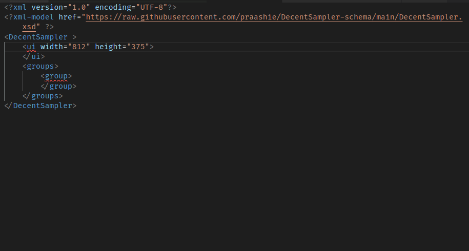
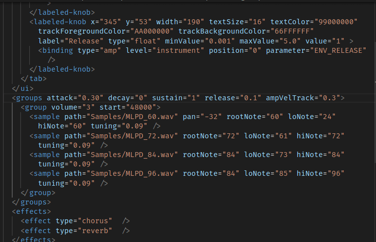
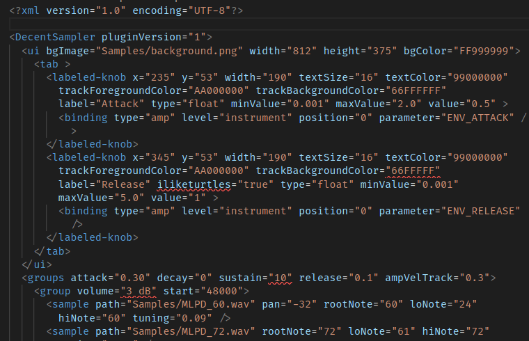
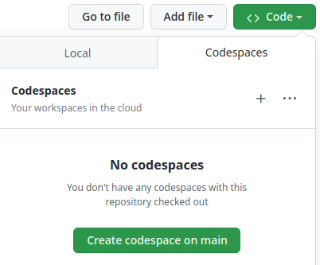

# DecentSampler Unofficial XML schema
## :bulb: Check your presets _right now_ with DSLint: [dslint.fly.dev](https://dslint.fly.dev/)
### Let's make `.dspreset` editing... **Decent**!

Making virtual instruments for [DecentSampler](https://www.decentsamples.com/product/decent-sampler-plugin/) eventually means some tedious editing of the XML-based `.dspreset` files by hand...

However, if you use a text editor that supports XML schemas, you can **super-charge your editing experience**:

* Use context-aware code completion and suggestions: 

* See documentation by hovering over a keyword: 

* Spot errors with tags, attributes, structure, and incorrectly formatted values: 

# How do I use this?

## Option 1: GitHub Codespaces

Press this button on the GitHub page to create a new codespace:



You will receive a VS Code editor inside your browser.
If you use Firefox and open local files, you might need to save the files to the codespace before the schema autocompletion kicks in.

## Option 2: Setup in VS Code

Install [Red Hat's XML editing extension](https://marketplace.visualstudio.com/items?itemName=redhat.vscode-xml).

# Try it out!

Paste the following contents in a new text file:
```xml
<?xml version="1.0" encoding="UTF-8"?>
<?xml-model href="https://raw.githubusercontent.com/praashie/DecentSampler-schema/main/DecentSampler.xsd" ?>
<DecentSampler >
    <ui width="812" height="375">

    </ui>
    <groups>
        <group>

        </group>
    </groups>
</DecentSampler>
```
Place your cursor inside the `<group>` tag, and hit <kbd>Ctrl</kbd>+<kbd>Space</kbd> to trigger suggestions!

## Edit an existing `.dspreset` with the schema

You can copy the `<?xml-model ...?>` line inside another `.dspreset` file to activate the schema.
This will also work with some online XML validation tools.

## Associate the schema with all `*.dspreset` files

### :warning: If you have trouble with this, use the previous section's `xml-model` line as a workaround.

Open your `settings.json` [(instructions here)](https://stackoverflow.com/a/65909052), and copy the following settings inside it:

```json
{
    "xml.fileAssociations": [
        {
            "pattern": "**/*.dspreset",
            "systemId": "https://raw.githubusercontent.com/praashie/DecentSampler-schema/main/DecentSampler.xsd"
        }
    ]
}
```

# A ...*schema*? Huh?

An XML Schema Definition (XSD) is a standard way to describe the expected structure of an XML document.

# Credits

Thanks to David Hilowitz for his exciting DecentSampler project.
This schema has been mostly based on the DecentSampler file format documentation: https://www.decentsamples.com/docs/format-documentation.html

This schema was kickstarted and edited with the VS Code extension [XML by Red Hat](https://marketplace.visualstudio.com/items?itemName=redhat.vscode-xml).
Impressive XSD-based code completion features are the main inspiration for developing this schema in the first place.